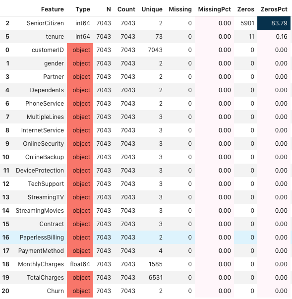
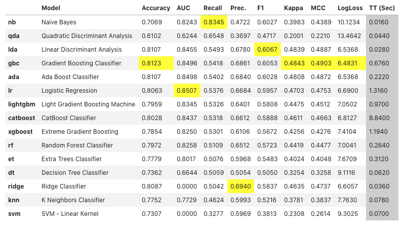
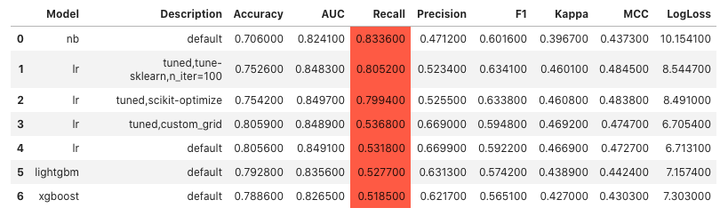

# Project Description
In this project I used the [Kaggle Customer Churn](https://www.kaggle.com/blastchar/telco-customer-churn)
data to determine whether the customer will churn (leave the company) or not.
I splitted the kaggle training data into train and test (80%/20%) and fitted
the models using train data and evaluated model results in test data.

I used mainly the semi automatic learning module `pycaret` for this project.
I also used usual boosting modules (`xgboost,lightgbm,catboost`) and regular
sklearn models.

In real life the cost of misclassifying leaving customer and not-leaving
customer is different. In this project I defined the PROFIT metric as following:
```
profit = +$400  for TP (true positive)
profit = 0      for TN (true negative)
profit = -$100  for FP (false positive)
profit = -$200  for FN (false negative)
```
After testing various models with extensive feature engineering, I found that
the logistic regression cv algorithm gave the best profit.

# Data description



# Data Processing
- Missing Value imputation for `TotalCharges` with 0.
- Label Encoding for features having 5 or less unique values.
- Binning Numerical Features.
- Combination of features. e.g `SeniorCitizen + Dependents`.
- Boolean Features. e.g. Does someone have Contract or not.
- Aggregation features. eg. Mean of `TotalCharges` per `Contract`.


# Sklearn Methods: LogisticRegression and LogisticRegressionCV
- Used raw data with new features from EDA.
- Used SMOTE oversampling since data is imbalanced.
- Used `yeo-johnson` transformers instead of standard scaling since the numerical features were not normal.
- Tuned the model using [hyperband](https://github.com/thuijskens/scikit-hyperband) library.


```
      Accuracy  Precision Recall    F1-score    AUC
LR    0.4450    0.3075    0.8717    0.4547    0.5812

                                                         Predicted

                    Predicted-noChurn  Predicted-Churn    0    1
Original no-Churn    [[301             734]               TN   FP
Original Churn       [ 48              326]]              FN   TP


Let's make following assumptions
TP = +$400
TN = 0
FP = -$100
FN = -$200

profit = tn*0 + fp*(-100) + fn*(-200) + tp*400
       = 400*tp - 200*fn - 100*fp

tn,fp,fn,tp = confusion_matrix(y_true,y_pred)

             LAST+    2ndrow  1strow
profit = 400*326 - 200*48 - 100*734
       = 47400


============================ LogisticRegressoinCv======================

        Accuracy  Precision Recall    F1-score    AUC
LRCV    0.7367    0.5024    0.8396    0.6286    0.7695

[[724 311]
 [ 60 314]]

profit = 82,500
```

# Boosting: Xgboost and catboost
- Used custom data cleaning.
- Used xgb classifier with custom scoring function from Hyperband.

```
           Accuracy  Precision    Recall    F1-score    AUC
xgboost    0.7097    0.4749       0.8850    0.6181    0.7657

[[669 366]
 [ 43 331]]

Profit = $87,200


CatBoostClassifier + optuna
                   Accuracy     Precision Recall    F1-score    AUC
catboost+optuna    0.7204       0.4843    0.8235    0.6099    0.7533
[[707 328]
 [ 66 308]]

 profit = $77,200
```

# Modelling Pycaret
- Used detailed cleaned data.
- Pycaret uses gpu for xgboost and lightgbm in colab.
- Pycaret does not have model interpretation (SHAP) for non-tree based models.
- Simple model comparison gave naive bayes as the best model.
- Used additional metrics `MCC and LogLoss`.
- Used `tune-sklearn` algorithm to tune logistic regression.
- The model calibration in pycaret DID NOT improve the metric.





```
Pycaret Logistic Regression
==============================================================
            Accuracy Precision Recall    F1-score    AUC
pycaret_lr    0.7509 0.5199    0.8021    0.6309      0.7673

[[758 277]
 [ 74 300]]

profit = 400*300 - 200*74 - 100*277
       = 77,500

Pycaret Naive Bayes
==============================================================
            Accuracy  Precision Recall    F1-score    AUC
pycaret_nb  0.7296    0.4943    0.8102    0.6140      0.7553
[[725 310]
 [ 71 303]]

profit = 400*303 - 200*71 - 100*310
       = 76,000

Pycaret Xgboost (Takes long time, more than 1 hr)
===============================================================

                  Accuracy Precision Recall  F1-score  AUC
pycaret_xgboost    0.7601  0.5342    0.7513  0.6244    0.7573

[[790 245]
 [ 93 281]]

profit = 400*281 - 200*93 - 100*245
       = 69,300

 Pycaret LDA (Takes medium time, 5 mintues)
================================================================
- Used polynomial features and fix imbalanced data.

               Accuracy  Precision    Recall    F1-score  AUC
pycaret_lda    0.7062    0.4704       0.8503    0.6057    0.7522


[[677 358]
 [ 56 318]]

profit = 400*318 - 200*56 - 100*358
       = 80,200
```

# EvalML method
- Minimal data processing (dropped gender and make some features numeric)
- evalml itself deals with missing values and categorical features.

```
          Accuracy  Precision Recall    F1-score  AUC
evalml    0.7977    0.6369    0.5535    0.5923    0.7197

[[917 118]
 [167 207]]

profit = 400*207 - 200*167 - 100*118
       = 37,600

```


# Deep Learning models
- Used minimal data processing.
- Dropped `customerID` and `gender`.
- Imputed `TotalCharges` with 0.
- Created dummy variables from categorical features.
- Used standard scaling to scale the data.
- Used `class_weight` parameter to deal with imbalanced data.
- Tuned keras model with scikitlearn `GridSearchCV`

```python
Model parameters
{'activation': 'sigmoid',
 'batch_size': 128,
 'epochs': 30,
 'n_feats': 43,
 'units': (45, 30, 15)}

NOTE: The result changes each time even if I set SEED for everything.

      Accuracy  Precision Recall    F1-score    AUC
keras 0.6849    0.4422    0.7166    0.5469    0.6950
[[697 338]
 [106 268]]

profit = 400*268 - 200*106 - 100*338
       = 52,200
```

# Model Comparison

```
This is a imbalanced binary classification.
The useful metrics are AUC and Recall.
Here I defined a custom metric "profit" based on confusin matrix elements.

- Logistic regression cv algorigthm gave me the best profit.
- I used custom feature engineering of the data.
- SMOTE oversampling gave worse result than no resampling.
  (note: I have used class_weight='balanced')
- Elasticnet penalty gave worse result than l2 penalty.
- Make custom loss scorer instead of default scoring such as f1,roc_auc,recall.

Profit = 400*TP  - 200*FN - 100*FP

TP = +$400 ==> incentivize the customer to stay, and sign a new contract.
TN = 0
FP = -$100 ==> marketing and effort used to try to retain the user
FN = -$200 ==> revenue from losing a customer

                 Accuracy   Precision Recall       F1-score       AUC  Profit
-------------------------------------------------------------------------------
xgboost          0.7097     0.4749    0.8850       0.6181    0.7657    $87,200
LRCV             0.7367     0.5024    0.8396       0.6286    0.7695    $82,500
pycaret_lda      0.7062     0.4704    0.8503       0.6057    0.752200  $80,200
pycaret_lr       0.750887   0.519931  0.802139     0.630915  0.767253  $77,500
catboost+optuna  0.7204     0.4843    0.8235       0.6099    0.7533    $77,200
pycaret_nb       0.729595   0.494290  0.810160     0.613982  0.755322  $76,000
pycaret_xgboost  0.760114   0.534221  0.751337     0.624444  0.757311  $69,300
keras            0.684883   0.442244  0.716578     0.546939  0.695004  $52,200
LR               0.444996   0.307547  0.871658     0.454672  0.581240  $47,400
evalml           0.7977     0.6369    0.5535       0.5923    0.719700  $37,600
```
